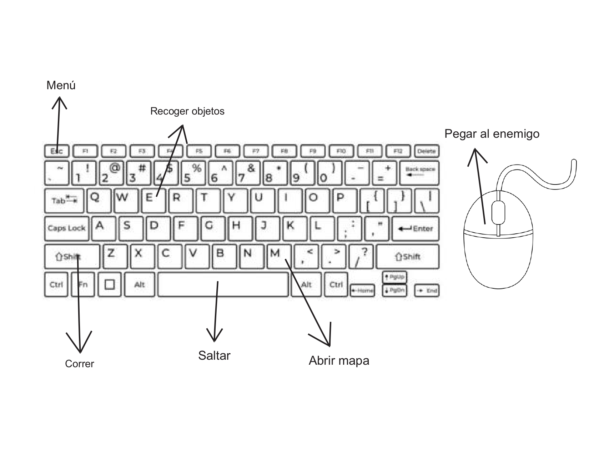

# Cristel

**Desarrolladores:**

Danna Paola Villegas Méndez

Enrique Guzmán Laguna

Diana Aileen Coyotl Rojas

Portada del juego:

## Tabla de evaluación del equipo.

| Nombre | Colaboración | Comunicación | Responsabilidad

|Danna Paola Villegas Méndez | 10 | 8 | 9|

|Enrique Guzmán Laguna | 9 | 10 | 8 |

|Diana Aileen Coyotl Rojas |9 | 8 | 10 |

## 1. Propósito de tu juego

### 1.1 Resumen del juego

Este juego tiene como inspiraciones a Zelda, Pokemón y Stardew Valley, es un rpg de aventura, y slash. El estilo gráfico es 2d pixel art.
El jugador puede elegir entre dos personajes, ya sea el guerrero o la chica mágica.
El objetivo principal es derrotar al enemigo principal, las hadas; por lo que el jugador deberá recoger ítems, y principalmente flores a lo largo del camino para adquirir poderes especiales.
El juego se ambienta en un bosque mágico, lleno de plantas y flores. El jugador poco a poco va descubriendo más parte de la historia para llegar al jefe final de las hadas. 

### 1.2 Resumen de la historia del juego

Se cuenta una leyenda sobre los Cristel, que son un grupo de elfos en el que se dividían dependiendo de su sabiduría y poder; los reyes y los nobles. Aquellos elfos tienen a los gatos como su deidad principal.
Su religión, la floridia veneraba mucho a las plantas, flores y creían que su alma es una semilla que al crecer, florecerá. En sus templos cultivaban muchos tipos de plantas que al comerlas les otorga distintos poderes. Los sacerdotes transmitían sus conocimientos de herbolaria a los Cristel.

## 2. Jugabilidad

Con las teclas A, w, s, d se mueve el personaje, para saltar será con la tecla de espacio, para interactuar con los objetos (recoger las flores que se vaya encontrando el personaje) la tecla "e" , con click izquierdo para pegar al enemigo, para abrir el menu la tecla "escape", para correr se deberá presionar la tecla "shift", y para abrir el mapa se debe presionar la tecla "m".

## 3. Mundo del juego

Este juego será en pixel art, principalmente con colores fríos y brillantes. La música será tranquila y en 8-bit.
En efectos de sonido, habrá sonido de viento, de cristales, de plantas.
Efecto de cuando el personaje va caminando por cierto lugar.
El jugador debe elegir entre el guerrero o la chica mágica, en caso de que elija al guerrero el arma principal será la espada, y en caso de que elija a la chica mágica el arma principal será el cetro mágico. Al principio hay una breve introducción a la historia que explica quiénes son los cristels y porqué sus enemigos principales son las hadas. El jugador debe ir recogiendo las notas para avanzar más en la historia y así llegar al jefe final. 
A lo largo de su aventura, puede ir recogiendo flores y llevándolas a los templos para convertirlas en pociones para adquirir alguna otra habilidad especial.

## 4. Mecánicas del Juego

Se puede interactuar con los npc’s, pero sin influir en la historia, sólo servirán para dar instrucciones, como en el caso de los sacerdotes que están en el templo, ellos explicarán al jugador para qué sirven las flores y cómo convertirlas en pociones.
El jugador puede correr con shift y recoger objetos con la tecla” e”.
 

## 5. Personajes

[Es importante que incluyan al menos dos personajes principales completamente diseñados.]: # 

## 6. Plan del proyecto

[El plan debe incluir un diagrama de Gantt con el cronograma de desarrollo, ten en cuenta las fechas.]: # 

## 7. Bibliografía

[Cada fuente debe ser citada de manera correcta, siguiendo el formato APA.]: # 

