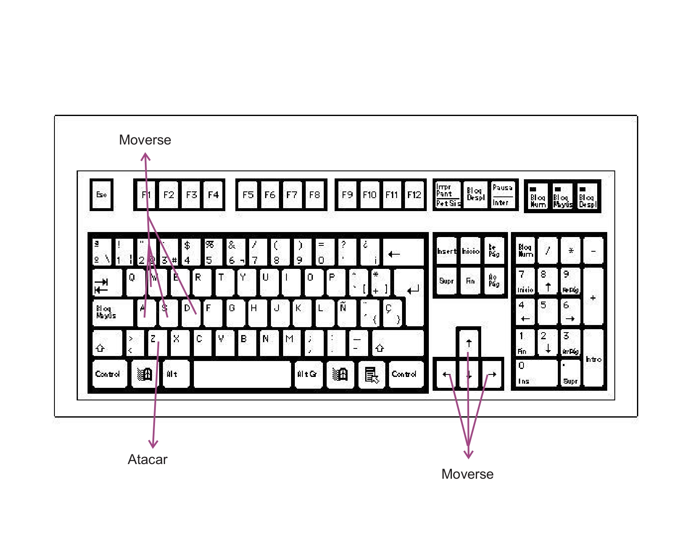
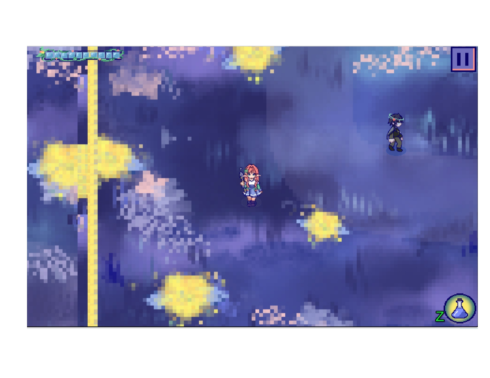
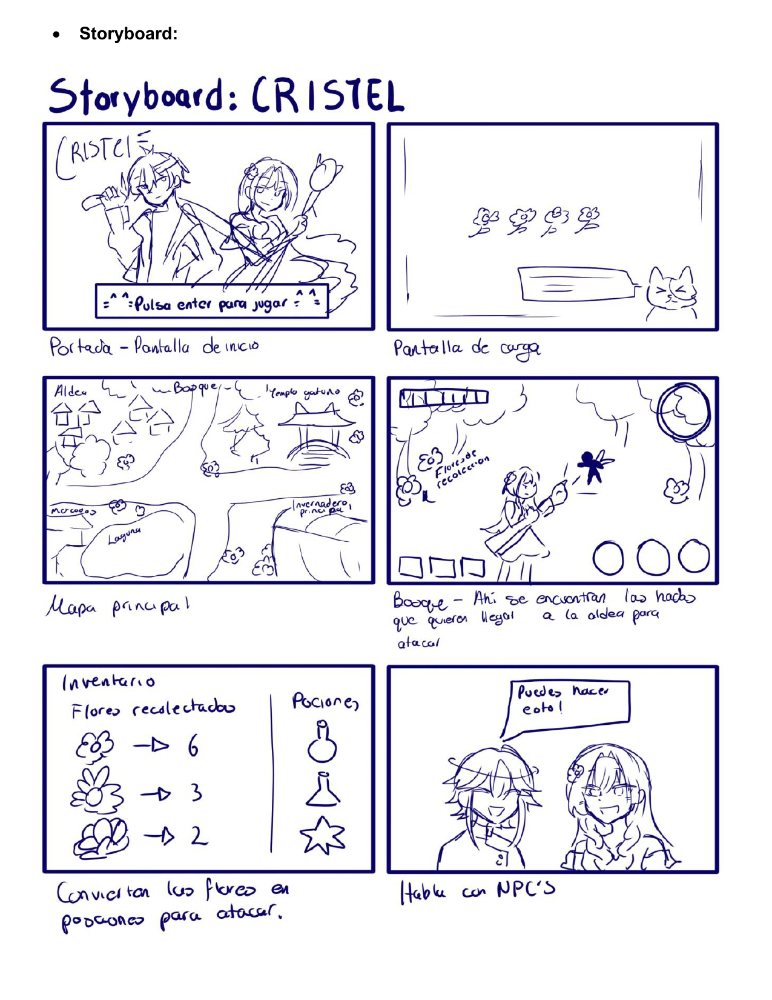
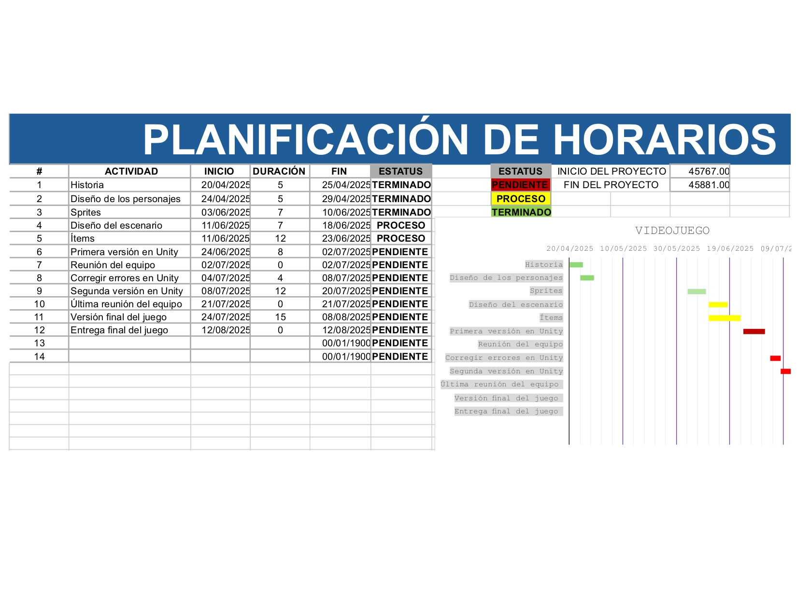
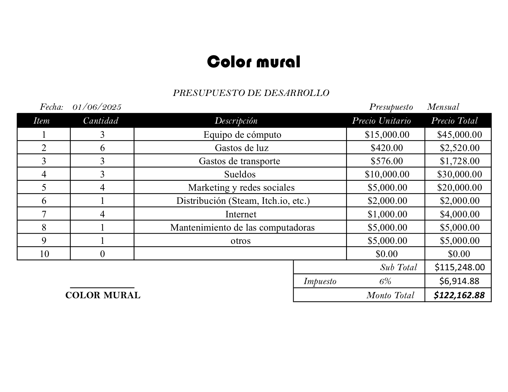

# Cristel

**Desarrolladores:**

Danna Paola Villegas Méndez

Enrique Guzmán Laguna

Diana Aileen Coyotl Rojas

Portada del juego:

## Tabla de evaluación del equipo.

| Nombre | Colaboración | Comunicación | Responsabilidad

|Danna Paola Villegas Méndez | 10 | 8 | 9|

|Enrique Guzmán Laguna | 9 | 10 | 8 |

|Diana Aileen Coyotl Rojas |9 | 8 | 10 |

## 1. Propósito de tu juego

### 1.1 Resumen del juego

Este juego tiene como inspiraciones a Zelda, Pokemón y Stardew Valley, es un rpg de aventura, y slash. El estilo gráfico es 2d pixel art. 
El juego tiene como personaje principal a una chica mágica. El objetivo principal es derrotar al enemigo principal, las hadas; al terminar de derrotar a las hadas, el jugador podrá recoger flores para que pueda pasar al siguiente nivel. 
El juego se ambienta en un bosque mágico, lleno de plantas y flores. 

### 1.2 Resumen de la historia del juego

Se cuenta una leyenda sobre los Cristel, que son un grupo de elfos en el que se dividían dependiendo de su sabiduría y poder; los reyes y los nobles. Aquellos elfos tienen a los gatos como su deidad principal. Su religión, la floridia veneraba mucho a las plantas, flores y creían que su alma es una semilla que, al crecer, florecerá. En sus templos cultivaban muchos tipos de plantas. Los sacerdotes transmitían sus conocimientos de herbolaria a los Cristel.

## 2. Jugabilidad

Ya sea con las teclas A, w, s, d, o las flechas, se puede mover el personaje.  Mientras que con la tecla Z, puede activar su poder y atacar a los enemigos.

## 3. Mundo del juego

El estilo gráfico de “CRISTEL” estará inspirado en títulos clásicos como The Legend of Zelda: The Minish Cap y Stardew Valley, utilizando una estética pixel art en 2D con vista cenital (top-down). Este estilo permitirá reflejar la magia del bosque y la fantasía del mundo de los elfos. 
La paleta de colores estará compuesta principalmente por tonos fríos que aportan una atmósfera nocturna, tranquila y mágica. Predominarán los azules profundos, morados suaves, y verdes aqua, creando una sensación de calma y conexión con la naturaleza. El rosa se usará en detalles mágicos y elementos luminosos, aportando un toque delicado. El color amarillo, en cambio, será vibrante y resaltará en puntos clave, como en las flores mágicas que iluminan el entorno o marcan zonas importantes. Este contraste ayudará a guiar visualmente al jugador y a enriquecer la estética mágica del bosque. 
Los personajes tienen proporciones estilizadas, con cabezas ligeramente más grandes para resaltar sus expresiones, tendrán movimientos animados en pixel art. El diseño de los personajes hace que resalten más contrastando con los escenarios.

• Interfaz del usuario: La interfaz del usuario (GUI) se integrará con el estilo natural: barras de vida representadas con estilo de flores, ícono de su poder mágico con forma circular, y menús enmarcados con madera y hojas pixeladas. 

• Barra de vida: Representada por una flor con pétalos. A medida que el personaje recibe daño, los pétalos se marchitan o caen. Estará ubicada en la esquina superior izquierda. 
• Habilidad: Representada por una poción, el personaje principal puede lanzar magia de su cetro mágico hacia el enemigo.

## 4. Mecánicas del Juego

El jugador puede interactuar con el enemigo atacándolo con la tecla Z. El personaje se puede mover con las teclas A, W, S, D o también usando las flechas.

## 5. Personajes

Hana: Posee un cetro mágico como arma principal; ataca a distancia, es la encargada del cuidado de los jardines de las diferentes plantas, tiene una personalidad sabia, pacifista y amable. Siente una gran conexión con las plantas y le complace el poder cuidarlas y saber acerca de los poderes que estas radican.
Fëanor: Es un guerrero es un joven sabio y fuerte, es un guerrero como muchos, que se encargan de defender la ciudad por si hay peligros, él tiene una personalidad bastante seria y fría, pero se esfuerza al máximo por hacerse más fuerte con el poder de las flores para ayudar a su pueblo. A pesar de que en el juego sólo aparece como un npc.

## 6. Plan del proyecto

Estrategia de monetización: 
Para que nuestro videojuego sea sostenible, necesitamos una estrategia de monetización que respete al jugador y permita recuperar la inversión.
Modelo principal
Se venderá mediante un pago único entre $60 y $100 MXN. Dependiendo la plataforma. Más adelante se lanzarán DLCs opcionales con nuevas funciones o contenido adicional.
Lanzamiento y comunidad
Iniciaremos con una demo gratuita en Itch.io y un acceso anticipado en Steam. Usaremos redes sociales y plataformas para conectar con la comunidad.
Ingresos adicionales
Ofreceremos una tienda dentro del juego donde se puedan conseguir skins para las armas o nuevos atuendos para los personajes. Algunos de estos cosméticos se podrán conseguir viendo anuncios o simplemente jugando.
Plataformas
El juego se publicará en Steam (por su alcance) e Itch.io (por su flexibilidad), permitiendo experimentar con distintos modelos de venta y visibilidad.

## 7. Bibliografía

2D Pixel Art Top-Down Character Template (3/4 perspective) by ZeggyGames. (s. f.). itch.io. https://zegley.itch.io/2d-pixel-art-top-down-character-template 

Free - Pixel Art Asset Pack - Topdown Tileset - 16x16 Sprites by Anokolisa. (s. f.). itch.io. https://anokolisa.itch.io/free-pixel-art-asset-pack-topdown-tileset-rpg-16x16-sprites 

Guía definitiva para crear un diagrama de Gantt. (s. f.). https://miro.com/. https://miro.com/es/planificacion-estrategica/como-hacer-diagrama-de-gantt/

Mecánicas. 
Lo que hace a un videojuego ser un juego. (s. f.). https://es.alg.academy/mecnicasloquehaceunvideojuego 

¿Qué es el Game Design Document? | Tokio School. (s. f.). Tokio School. https://www.tokioschool.com/noticias/que-es-game-design-document/ 

